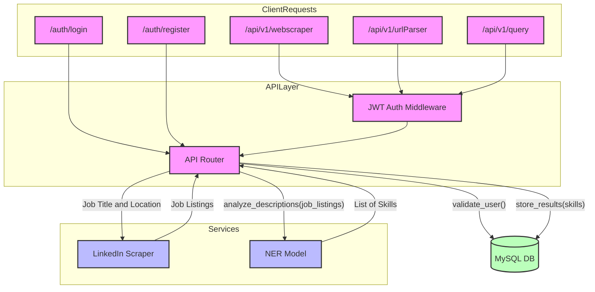

```mermaid
flowchart TD
    subgraph ClientRequests
        direction LR
        Login["/auth/login"]
        Register["/auth/register"]
        Scrape["/api/v1/webscraper"]
        Parse["/api/v1/urlParser"]
        Query["/api/v1/query"]
    end

    subgraph APILayer
        direction LR
        Router[API Router]
        Auth[JWT Auth Middleware]
    end

    subgraph Services
        direction LR
        WebScraper[LinkedIn Scraper]
        NeuralNet[NER Model]
    end

    Database[(MySQL DB)]

    %% Request Flow
    Login --> Router
    Register --> Router
    Scrape & Parse & Query --> Auth
    Auth --> Router

    %% Service Flow
    Router -->|"validate_user()"| Database
    Router -->|"Job Title and Location"| WebScraper
    Router -->|"analyze_descriptions(job_listings)"| NeuralNet
    
    %% Results Flow
    WebScraper -->|"Job Listings"| Router
    NeuralNet -->|"List of Skills"| Router
    Router -->|"store_results(skills)"| Database

    classDef api fill:#f9f,stroke:#333,stroke-width:2px
    classDef service fill:#bbf,stroke:#333,stroke-width:2px
    classDef data fill:#bfb,stroke:#333,stroke-width:2px
    
    class Login,Register,Scrape,Parse,Query,Router,Auth api
    class WebScraper,NeuralNet service
    class Database data
```