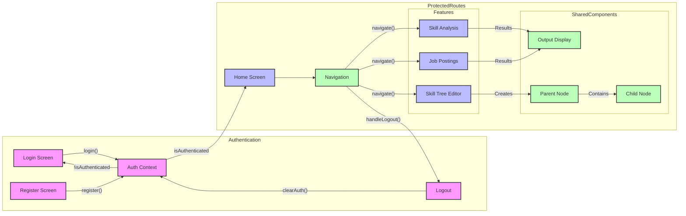

```mermaid
flowchart LR
    subgraph Authentication
        direction TB
        Login[Login Screen]
        Register[Register Screen]
        Auth[Auth Context]
        Logout[Logout]
        
        Login -->|"login()"| Auth
        Register -->|"register()"| Auth
        Logout -->|"clearAuth()"| Auth
    end

    subgraph ProtectedRoutes
        direction TB
        Home[Home Screen]
        Nav[Navigation]
        
        subgraph Features
            direction TB
            Skills[Skill Analysis]
            Jobs[Job Postings]
            SkillTree[Skill Tree Editor]
        end
        
        subgraph SharedComponents
            direction TB
            Output[Output Display]
            ParentNode[Parent Node]
            ChildNode[Child Node]
        end
    end

    %% Authentication to Protected Routes
    Auth -->|"isAuthenticated"| Home
    Auth -->|"!isAuthenticated"| Login
    
    %% Navigation Flow
    Home --> Nav
    Nav -->|"navigate()"| Skills
    Nav -->|"navigate()"| Jobs
    Nav -->|"navigate()"| SkillTree
    Nav -->|"handleLogout()"| Logout
    
    %% Component Connections
    Skills -->|"Results"| Output
    Jobs -->|"Results"| Output
    SkillTree -->|"Creates"| ParentNode
    ParentNode -->|"Contains"| ChildNode

    classDef auth fill:#f9f,stroke:#333,stroke-width:2px
    classDef screen fill:#bbf,stroke:#333,stroke-width:2px
    classDef component fill:#bfb,stroke:#333,stroke-width:2px
    
    class Login,Register,Auth,Logout auth
    class Home,Skills,Jobs,SkillTree screen
    class Nav,Output,ParentNode,ChildNode component
```