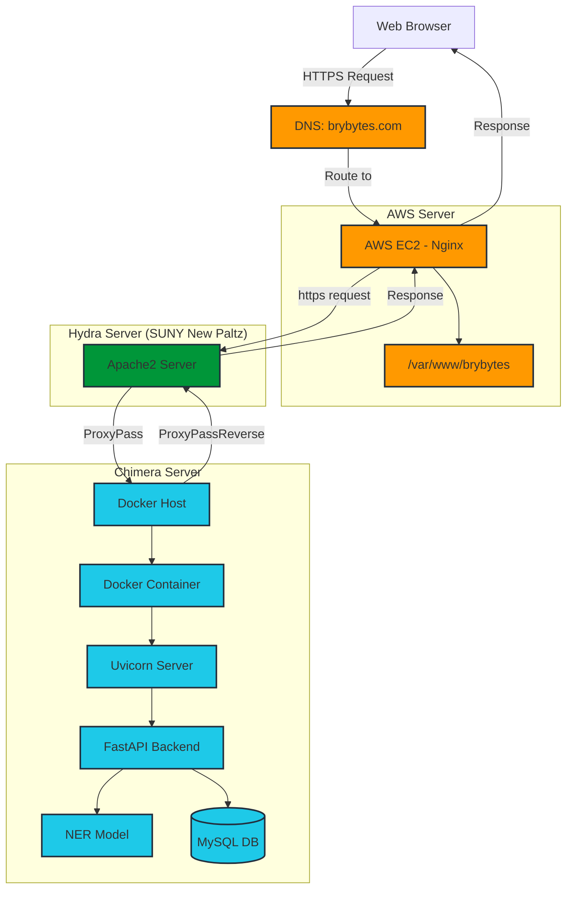

```mermaid
graph TD
    Client[Web Browser]
    DNS[DNS: brybytes.com]
    
    subgraph "AWS Server"
        AWS[AWS EC2 - Nginx]
        WebRoot["/var/www/brybytes"]
        AWS --> WebRoot
    end
    
    subgraph "Hydra Server (SUNY New Paltz)"
        Hydra[Apache2 Server]
    end
    
    subgraph "Chimera Server"
        Chimera[Docker Host]
        Container[Docker Container]
        Uvicorn[Uvicorn Server]
        FastAPI[FastAPI Backend]
        NER[NER Model]
        MySQL[(MySQL DB)]
        
        Chimera --> Container
        Container --> Uvicorn
        Uvicorn --> FastAPI
        FastAPI --> NER
        FastAPI --> MySQL
    end
    
    %% Request Flow
    Client -->|"HTTPS Request"| DNS
    DNS -->|"Route to"| AWS
    AWS -->|"https request"| Hydra
    Hydra -->|"ProxyPass"| Chimera
    
    %% Response Flow
    Chimera -->|"ProxyPassReverse"| Hydra
    Hydra -->|"Response"| AWS
    AWS -->|"Response"| Client

    classDef aws fill:#ff9900,stroke:#232f3e,stroke-width:2px;
    classDef hydra fill:#009639,stroke:#232f3e,stroke-width:2px;
    classDef chimera fill:#1ec9e8,stroke:#232f3e,stroke-width:2px;
    
    class DNS,AWS,WebRoot aws;
    class Hydra hydra;
    class Chimera,Container,Uvicorn,FastAPI,NER,MySQL chimera;
```