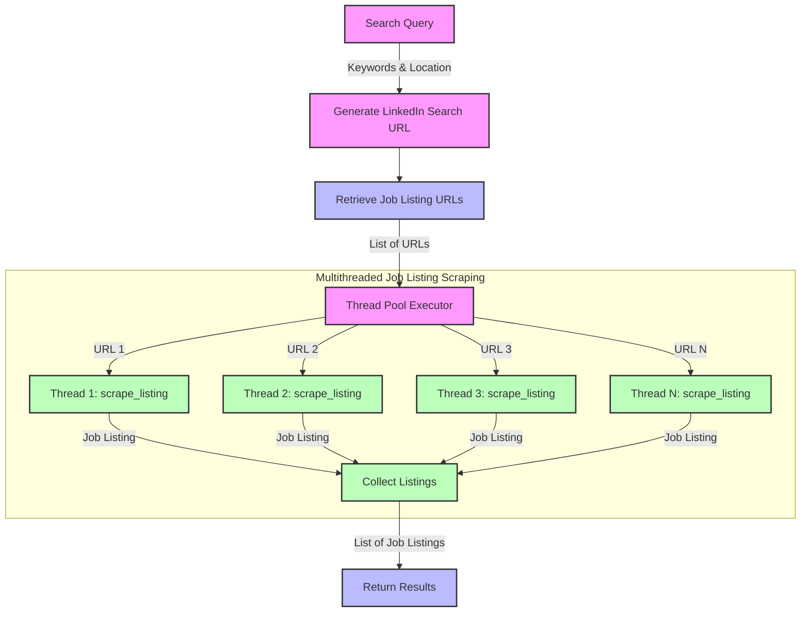

```mermaid
graph TB
    A[Search Query] -->|Keywords & Location| B[Generate LinkedIn Search URL]
    B --> C[Retrieve Job Listing URLs]
    C -->|List of URLs| D[Thread Pool Executor]
    
    subgraph "Multithreaded Job Listing Scraping"
        D -->|URL 1| E1[Thread 1: scrape_listing]
        D -->|URL 2| E2[Thread 2: scrape_listing]
        D -->|URL 3| E3[Thread 3: scrape_listing]
        D -->|URL N| E4[Thread N: scrape_listing]
        
        E1 -->|Job Listing| F[Collect Listings]
        E2 -->|Job Listing| F
        E3 -->|Job Listing| F
        E4 -->|Job Listing| F
    end
    
    F -->|List of Job Listings| G[Return Results]

    classDef process fill:#f9f,stroke:#333,stroke-width:2px;
    classDef data fill:#bbf,stroke:#333,stroke-width:2px;
    classDef thread fill:#bfb,stroke:#333,stroke-width:2px;
    
    class A,B,D process;
    class C,G data;
    class E1,E2,E3,E4,F thread;
```